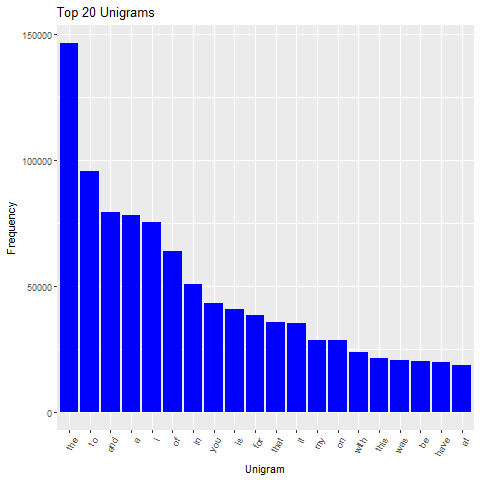
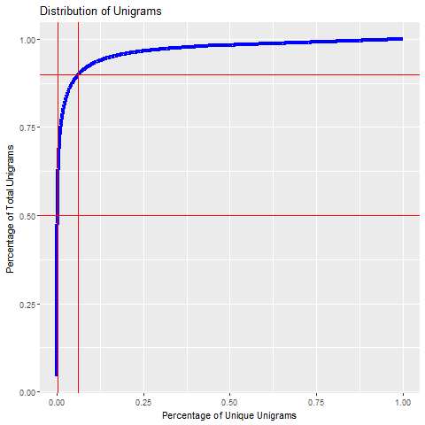
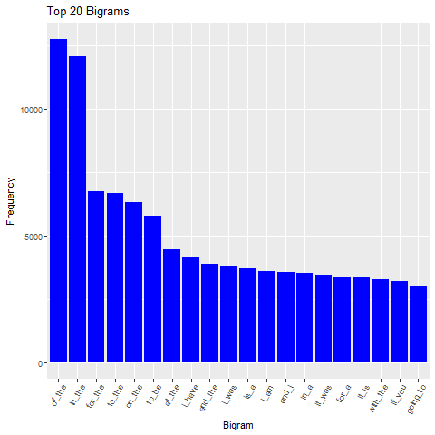
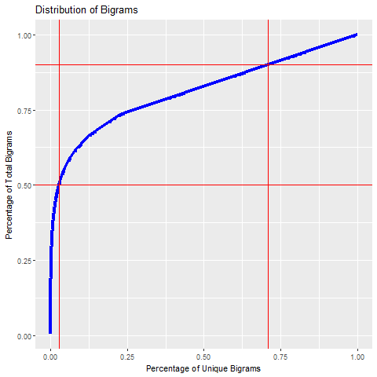
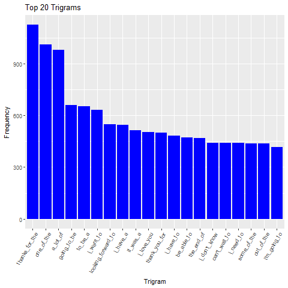
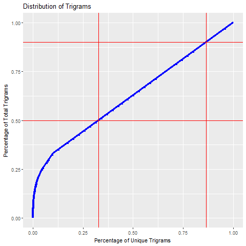

```{r setup, include=FALSE}
knitr::opts_chunk$set(echo = TRUE)
```

## Synopsis

This document will detail the exploratory analysis I've done with the text data I am using to build a predictive text model.  I will provide some basic statistics on the large data set provided.  Then I will provide some estimated frequencies and distributions of the words / tokens and phrases / n-grams projected from a random sample of the larger data set.  Finally, I'll provide a summary of my take on the data and how I plan to proceed in developing a text prediction algorithm. 

```{r, echo=FALSE}

load(file="counts.Rda")
load(file="corpdocs.Rda")
load(file="corpfeatures.Rda")
load(file="corpdocs.Rda")
load(file="corpfeatures.Rda")
options(scipen=1, digits = 2)
totalwords<-counts$blogwords+counts$newswords+counts$tweetwords

```

## Data Overview

The data set includes three large text files.

The en_us.blogs.txt file is a collection of text from blogs.  It includes:

- `r formatC(counts$blogdocs, big.mark=",")` documents
- `r formatC(counts$blogwords, big.mark=",")` words
- `r formatC(counts$blogwordsperdoc, big.mark=",")` words per document

The en_us.news.txt file is a collection of text from news outlets.  It includes:

- `r formatC(counts$newsdocs, big.mark=",")` documents
- `r formatC(counts$newswords, big.mark=",")` words
- `r formatC(counts$newswordsperdoc, big.mark=",")` words per document

The en_us.tweets file is a collection of text from tweets.  It includes:

- `r formatC(counts$tweetdocs, big.mark=",")` documents
- `r formatC(counts$tweetwords, big.mark=",")` words
- `r formatC(counts$tweetwordsperdoc, big.mark=",")` words per document

I read all three of these files into a single data frame, then used the quanteda package to create a single large corpus of all the text data.  The large corpus contains:

- `r formatC(corpdocs, big.mark=",")` documents
- `r formatC(corpfeatures, big.mark=",")` unique words

`r formatC(corpfeatures, big.mark=",")` unique words comprise a total language of `r formatC(totalwords, big.mark=",")` words.  This indicates that there are a small set of words that are used frequently.  This information should be useful as I begin to develop a model.

## Frequency Analysis

``` {r, echo=F, include=F}

load(file="tbl1.Rda")
load(file="tbl2.Rda")
load(file="tbl3.Rda")

library(dplyr)

# define intercepts where we reach 50 and 90 percent of total n-grams

y1a<-tbl1 %>%
  filter(pcttoken>=.5)
yint1a<-min(y1a$pctdoc)

y1b<-tbl1 %>%
  filter(pcttoken>=.9)
yint1b<-min(y1b$pctdoc)

y2a<-tbl2 %>%
  filter(pcttoken>=.5)
yint2a<-min(y2a$pctdoc)

y2b<-tbl2 %>%
  filter(pcttoken>=.9)
yint2b<-min(y2b$pctdoc)

y3a<-tbl3 %>%
  filter(pcttoken>=.5)
yint3a<-min(y3a$pctdoc)

y3b<-tbl3 %>%
  filter(pcttoken>=.9)
yint3b<-min(y3b$pctdoc)
```

To conserve system resources, I used the quanteda corpus_sample() function to randomly sample 5% of the larger corpus.  With this sample I analyzed the frequency distribution of 1, 2, and 3 grams to get an idea of how many n-grams I would need to cover the majority of the language in the corpus.

### Unigrams

The plot below shows the top 20 unigrams:




This next plot shows what percentage of unique unigrams I need to cover 50 and 90 percent of the total unigrams in the sample.  We can see that we only need `r yint1a*100`% of the unique unigrams to cover 50$ of the language and only `r yint1b*100`% to cover 90%.



### Bi-grams

The plot below shows the top 20 bigrams:



Now we will plot what percentage of unique bigrams I need to cover 50 and 90 percent of the total bigrams in the sample.  With bigrams we need `r yint2a*100`% of the unique bigrams to cover 50% of the language and `r yint2b*100`% to cover 90%.



### Trigrams

This plot shows the top 20 trigrams:



With trigrams, we see that there is a much higher percentage of low frequency occurances.  It takes `r yint3a*100`% of the unique trigrams to cover 50% of the total and `r yint3b*100`% of the uniques to cover 90%.  



## Next Steps

To me, the object of this project is to provide a utility that will aid the user by filling in the most common parts of the language as they are typing on their mobile device.  This means that the app should be as proficient as possible at providing support for common phrases and not worrry too much about those less frequently used.  It seems that as n gets larger the coverage of the most frequent n-grams gets smaller.  I plan to explore the appropriate frequency cut-offs for 3, 4, and 5 grams to get the most common phrases predicted accurately.

### Model and Application Development

As I move forward with developing a text prediciton model, I will be exploring the following areas further:

#### Stop Words
So far, I have left the stop words in the corpus as I think they need to be included for accurate prediction.

#### n-grams
I will be exploring adding 4, 5, and 6 grams into the model

#### Coverage
To manage the size of the data behind the algorithm, I will look at how many of the infrequent n-grams I can drop from the data set.  I plan treat these improbable n-grams with the same smoothing procedure I'll use to account for terms not in the corpus.

#### Source data
It seems that the blog data is the most conversational of all the data sets.  It might make sense to oversample or only use this data set vs. the news and twitter data.

#### Shiny App
I am not an HTML expert.  I plan to adapt the shiny app that I created for the data products course for this project.  My main focus will be on making the model as accurate and efficient as possible.  If I have extra time after that is accomplished, I'll spend some time trying to make it look pretty as well.

#### Code
All of the code to perform my analysis and generate this document can be found at [this](https://github.com/lecroc/CapstoneExploratory) github repo.


