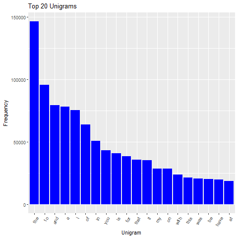

## Synopsis

This document will detail the exploratory analysis I've done with the text data I am using to build a predictive text model.  I will provide some basic statistics on the large data set provided.  Then I will provide some estimated frequencies and distributions of the words / tokens and phrases / n-grams projected from a random sample of the larger data set.  Finally, I'll provide a summary of my take on the data and how I plan to proceed in developing a text prediction algorithm. 

## Data Overview

The data set includes three large text files.

The en_us.blogs.txt file is a collection of text from blogs.  It includes:

- 899,288 documents
- 37,334,131 words
- 41.52 words per document

The en_us.news.txt file is a collection of text from news outlets.  It includes:

- 77,259 documents
- 2,643,969 words
- 34.22 words per document

The en_us.tweets file is a collection of text from tweets.  It includes:

- 2,360,148 documents
- 30,373,543 words
- 12.87 words per document

I read all three of these files into a single data frame, then used the quanteda package to create a single large corpus of all the text data.  The large corpus contains:

- 3,336,695 documents
- 738,533 unique words

738,533 unique words comprise a total language of 70,351,643 words.  This indicates that there are a small set of words that are used frequently.  This information should be useful as I begin to develop a model.

## Frequency Analysis

To conserve system resources, used the quanteda corpus_sample() function to randomly sample 5% of the larger corpus.  With this sample I analyzed the frequency distribution of 1, 2, and 3 grams to get an idea of how many n-grams I would need to cover the majority of the language in the corpus.

### Unigrams

The plot below shows the top 20 unigrams:

